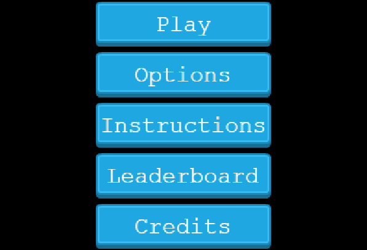

<p align="center">
  <a href="https://github.com/jcy2704/oop-ruby">
    
  </a>
</p>

<h1 align="center">RPG Game</h1>

<p align="center">
  <strong>Made by Alan Soto</strong>
  <br>
    This is an application about a basic 2D Roll Playing Game with heroes moving through a small world, sorting obstacles, and facing enemies. In each battle, you can earn some points if you defeat the enemies, the purpose of the game is to earn as many points as possible. In this case, our hero is a manatee in a sea world facing evil octopuses and jellyfishes. It was developed using the Phaser library.
</p>


<p align="center">
  
</p>

<hr>

<p align="center">
  <a href="https://github.com/AlanSoto31/RPG-Game/issues">
    
  </a>
   ‎ ‎ ‎ ‎
  <a href="https://github.com/AlanSoto31/RPG-Game/issues">
    
  </a>
</p>

<hr>


## Table of Contents

- [Live Demo](#Live-Demo)
- [About the game](#about-the-game)
- [Built With](#built-With)
- [🖥️ Getting Started](#getting-Started)
  - [Prerequisites](#prerequisites)
  - [Setup](#setup)
  - [Testing](#testing)
- [👥 Author](#author)
- [🤝 Contributing](#contributing)
- [⭐ Show your support](#show-your-support)
- [Acknowledgments](#acknowledgments)


## Live Demo

[Live version](https://alansoto31.github.io/RPG-Game/)

## About the game

Once the game ran, a menu displays.

- Play button to start the game 
- Options button to disable/enable soundtrack.
- Credits button to see the developers.




In order to start the game, you need to enter a name (12 characters maximum) that will be saved along with your score. Hopefully, you can appear in the third-highest position.


Enjoy the game moving around the world with the arrow-keys.


Take some battles to increase your reputation as a hero.

- Press space-bar/left-arrow once to be able to select an enemy. 
- Select an enemy with up-arrow/down-arrow. 
- Attack an enemy pressing  space-bar/left-arrow.


Eventually, everyone dies, even the heroes. In this scene of the game, you will be able to see your final score and the three highest scores.


## Built With

- JavaScript
- Phaser
- Webpack
- Jest 
- VS Code


## Getting Started

Get a local copy, type on console...

````
 $ cd <'the location yo want to save the project'>
 $ git clone https://github.com/AlanSoto31/RPG-Game.git
 ````


### Prerequisites

- nodejs 14.16.0


### Setup

1. Go inside the project folder: `cd RPG-Game`.
2. Install dependencies: `npm install`.
4. Start the application: `npm run start`
5. Wait for the server to launch the app.
6. Stop the application: `ctrl + c`

### Testing

1. Go inside the project folder: `cd RPG-Game`.
2. Run the test: `npm run test`.`


## Author

👤 **Alan Soto**

- GitHub: [@AlanSoto31](https://github.com/AlanSoto31)
- Twitter: [@Alan_Soto31](https://twitter.com/Alan_Soto31)
- LinkedIn: [Alan Soto](https://www.linkedin.com/in/alan-soto-valle-b9a0511aa/)


## Contributing

Contributions, issues and feature requests are welcome!

Feel free to check the [issues page](https://github.com/AlanSoto31/RPG-Game/issues).


## Show your support

Give a ⭐️ if you like this project!


## Acknowledgments

- [Microverse](https://www.microverse.org/)
- [Zenva Pty Ltd](https://gamedevacademy.org/how-to-create-a-turn-based-rpg-game-in-phaser-3-part-1/)
- [Open Game Art](https://opengameart.org/)

## 📝 License

This project is [MIT](https://opensource.org/licenses/MIT) licensed.